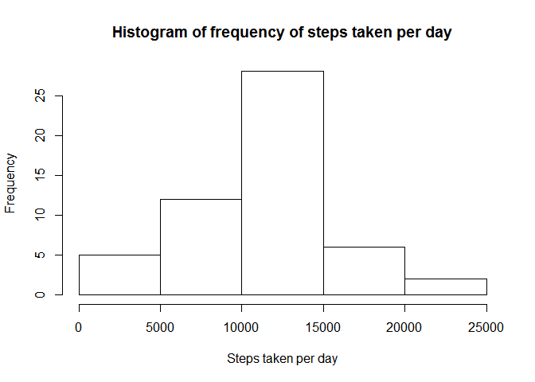
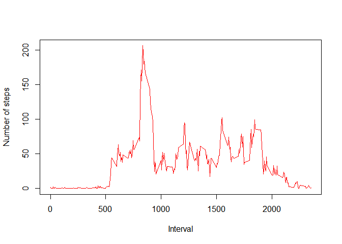
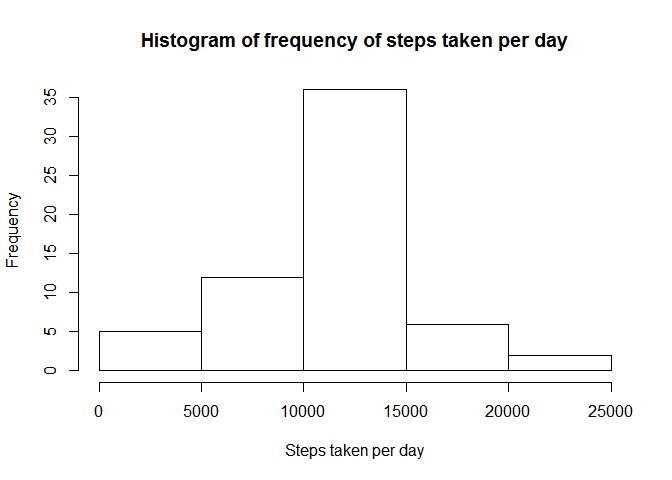
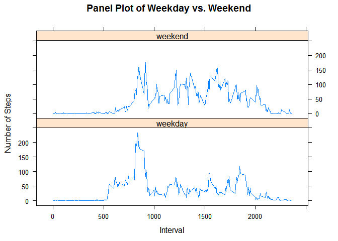

# Reproducible Research: Peer Assessment 1

## Loading and preprocessing the data

### 1. Load the data

```r
# Unzip the file and then load it. Check that it has the correct number of rows.
unzip("activity.zip","activity.csv")
steps <- read.csv("activity.csv") 
if(nrow(steps) == 17568 ) {
        print("File read successfully")
} else {
        print("File not read successfully. 17658 observations expected.")
}
```

```
## [1] "File read successfully"
```

```r
head(steps)
```

```
##   steps       date interval
## 1    NA 2012-10-01        0
## 2    NA 2012-10-01        5
## 3    NA 2012-10-01       10
## 4    NA 2012-10-01       15
## 5    NA 2012-10-01       20
## 6    NA 2012-10-01       25
```

### 2. Process/transform the data into a format suitable for analysis


```r
# Remove the missing values from the dataset
steps.sansna <- na.omit(steps)
head(steps.sansna)
```

```
##     steps       date interval
## 289     0 2012-10-02        0
## 290     0 2012-10-02        5
## 291     0 2012-10-02       10
## 292     0 2012-10-02       15
## 293     0 2012-10-02       20
## 294     0 2012-10-02       25
```

## What is the mean total number of steps taken per day?


```r
# Calculate the total number of steps taken per day
steps.per.day <- aggregate( steps ~ date , data = steps.sansna , FUN = sum )
head(steps.per.day)
```

```
##         date steps
## 1 2012-10-02   126
## 2 2012-10-03 11352
## 3 2012-10-04 12116
## 4 2012-10-05 13294
## 5 2012-10-06 15420
## 6 2012-10-07 11015
```

### 1. Create a histogram of the total number of steps taken each day


```r
# Create a histogram of the total number of steps taken each day
hist(steps.per.day$steps, main="Histogram of frequency of steps taken per day",xlab="Steps taken per day")
```

 

### 2. Calculate and report the mean and median total number of steps taken per day. 

```r
# Avoid scientific notation
options("scipen"=100, "digits"=4)

# Calculate the mean steps per day
mean.steps <- mean(steps.per.day$steps)
```
*The mean steps per day are 10766.1887*


```r
# Calculate the median steps per day
median.steps <- median(steps.per.day$steps)
median.steps <- median.steps
```
*The median steps per day are 10765*

## What is the average daily activity pattern?

### 1. Make a time series plot (i.e. type = "l") of the 5-minute interval (x-axis) and the average number of steps taken, averaged across all days (y-axis)

```r
# Calculate the average number of steps per interval and plot on a time series
steps.per.interval <- aggregate( steps ~ interval , data = steps.sansna , FUN = mean )
plot(steps.per.interval$interval, steps.per.interval$steps, xlab= "Interval", ylab= "Number of steps", type='l', col='red') 
```

 

### 2. Which 5-minute interval, on average across all the days in the dataset, contains the maximum number of steps?

```r
# Calulate the interval that has the most steps on average
max.interval <- steps.per.interval[which.max( steps.per.interval[,2] ),]$interval
```
*The interval that has the most steps on average is interval 835*

## Imputing missing values

### 1. Calculate and report the total number of missing values in the dataset (i.e. the total number of rows with NAs)

```r
# Calculate the number of missing values
missing <- length(unique(unlist (lapply (steps, function (x) which (is.na (x))))))
```
*The number of missing values is 2304*

### 2. Devise a strategy for filling in all of the missing values in the dataset. The strategy does not need to be sophisticated. For example, you could use the mean/median for that day, or the mean for that 5-minute interval, etc.

*We will use the rounded mean steps for a given interval to fill in the missing values of a corresponding interval. We use rounded steps because it is not natural for the underlying data set to be in decimals.*

### 3. Create a new dataset that is equal to the original dataset but with the missing data filled in.


```r
steps.imputed <- steps
steps.na.index <- unique(unlist (lapply (steps, function (x) which (is.na (x)))))
steps.na <- steps[steps.na.index,]
steps.imputed[steps.na.index,]$steps = unlist(lapply(steps.na$interval, function (x) round(steps.per.interval[which(steps.per.interval$interval==x),2])))
head(steps.imputed)
```

```
##   steps       date interval
## 1     2 2012-10-01        0
## 2     0 2012-10-01        5
## 3     0 2012-10-01       10
## 4     0 2012-10-01       15
## 5     0 2012-10-01       20
## 6     2 2012-10-01       25
```

### 4. a) Make a histogram of the total number of steps taken each day. 


```r
# Sum up the number of steps per day with imputed values added
imputed.steps.per.day <- aggregate( steps ~ date , data = steps.imputed , FUN = sum )
```


```r
#Create a histogram with imputed values added
hist(imputed.steps.per.day$steps, main="Histogram of frequency of steps taken per day",xlab="Steps taken per day")
```

 

### 4. b) Calculate and report the mean and median total number of steps taken per day


```r
# Calcuate the mean steps per day with imputed values added
steps.imputed.mean <- mean(imputed.steps.per.day$steps)
```
*The mean steps per day, with imputed values added, are 10765.6393*


```r
# Calculate median steps per day with imputed values added
steps.imputed.median <- median(imputed.steps.per.day$steps)
```
*The median steps per day, with imputed values added, are 10762*

### 4. c) Do these values differ from the estimates from the first part of the assignment?


```r
# Calculate percentage of replacements that were rounded down
round.down.percentage <- round(sum(unlist(lapply(steps.na$interval, 
                                function (x) round(steps.per.interval[which(steps.per.interval$interval==x),2]))) 
                <= unlist(lapply(steps.na$interval, 
                                function (x) steps.per.interval[which(steps.per.interval$interval==x),2])))
                /nrow(steps.na)*100)
```

*The mean and median are now slightly lower. This is could in part be because 58% of the interval averages used were rounded down. This would need to be in combination with entire days having missed data.* 

### 4. d) What is the impact of imputing missing data on the estimates of the total daily number of steps?
*If you impute missing data then the total number of daily steps is likely to increase.*

## Are there differences in activity patterns between weekdays and weekends? 

### 1. Create a new factor variable in the dataset with two levels -- "weekday" and "weekend" indicating whether a given date is a weekday or weekend day.


```r
# Create a new factor variable in the dataset with two levels – “weekday” and
# “weekend” indicating whether a given date is a weekday or weekend day.
library(chron)
```

```
## Warning: package 'chron' was built under R version 3.1.2
```

```r
steps.sansna$daytype <- NA
steps.sansna$daytype = apply(steps.sansna,1, function(x) 
        as.factor(if(is.weekend(x[2])) { "weekend" } else { "weekday" } ))
head(steps.sansna)
```

```
##     steps       date interval daytype
## 289     0 2012-10-02        0 weekday
## 290     0 2012-10-02        5 weekday
## 291     0 2012-10-02       10 weekday
## 292     0 2012-10-02       15 weekday
## 293     0 2012-10-02       20 weekday
## 294     0 2012-10-02       25 weekday
```


```r
# Calculate the average number of steps per interval for weekdays and weekends
steps.interval.daytype <- aggregate(steps.sansna$steps,list(interval = steps.sansna$interval, daytype = steps.sansna$daytype),mean)
colnames(steps.interval.daytype)[colnames(steps.interval.daytype)=="x"] <- "avg.steps"
head(steps.interval.daytype)
```

```
##   interval daytype avg.steps
## 1        0 weekday    2.3333
## 2        5 weekday    0.4615
## 3       10 weekday    0.1795
## 4       15 weekday    0.2051
## 5       20 weekday    0.1026
## 6       25 weekday    1.5128
```

### 2. Make a panel plot containing a time series plot (i.e. type = "l") of the 5-minute interval (x-axis) and the average number of steps taken, averaged across all weekday days or weekend days (y-axis)

```r
# Make a panel plot containing a time series plot (i.e. type = "l") of the
# 5-minute interval (x-axis) and the average number of steps taken, averaged
# across all weekday days or weekend days (y-axis)
library(lattice) 
attach(steps.interval.daytype)
xyplot( avg.steps~interval | daytype  , 
  	main="Panel Plot of Weekday vs. Weekend",
   xlab="Interval", ylab="Number of Steps",
   layout=c(1,2), type="l")
```

 
 
*There is definitely a difference between weekday and weekend patterns.*
